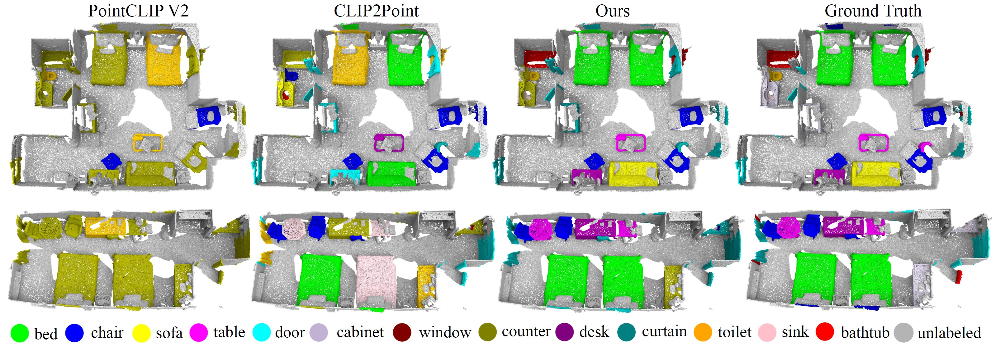
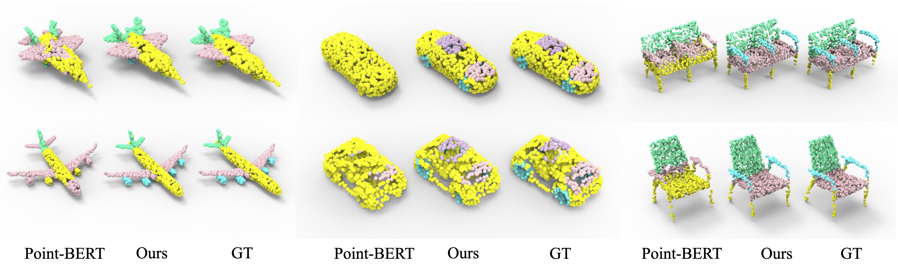
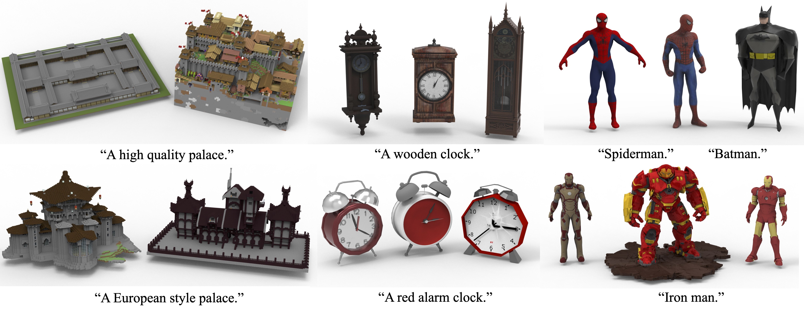
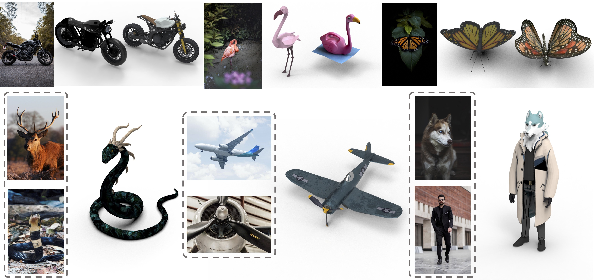

<div align='center'>

<h2><a href="https://arxiv.org/abs/2310.06773">Uni3D: Exploring Unified 3D Representation at Scale</a></h2>

[Junsheng Zhou](https://junshengzhou.github.io/)<sup>1,2*</sup>, [Jinsheng Wang](https://github.com/Wolfwjs/)<sup>1*</sup>, [Baorui Ma](https://mabaorui.github.io/)<sup>1*</sup>, [Yu-Shen Liu](https://yushen-liu.github.io/)<sup>2</sup>, [Tiejun Huang](https://scholar.google.com/citations?user=knvEK4AAAAAJ&hl=en)<sup>1,3</sup>, [Xinlong Wang](https://www.xloong.wang/)<sup>1</sup>
 
<sup>1</sup>[BAAI](https://www.baai.ac.cn/english.html), <sup>2</sup>[THU](https://www.tsinghua.edu.cn/en/), <sup>3</sup>[PKU](https://english.pku.edu.cn/) <br><sup>*</sup> Equal Contribution
 
ICLR 2024 (Spotlight)

[](https://paperswithcode.com/sota/zero-shot-3d-classification-on-objaverse-lvis?p=uni3d-exploring-unified-3d-representation-at)
[](https://paperswithcode.com/sota/zero-shot-transfer-3d-point-cloud?p=uni3d-exploring-unified-3d-representation-at)
[](https://paperswithcode.com/sota/zero-shot-transfer-3d-point-cloud-2?p=uni3d-exploring-unified-3d-representation-at)


</div>


<p align="center">
    
</p>

We present Uni3D, a unified and scalable 3D pretraining framework for large-scale 3D representation learning, and explore its limits at the scale of one billion parameters.
Uni3D uses a 2D initialized ViT end-to-end pretrained to align the 3D point cloud features with the image-text aligned features. Via the simple architecture and pretext task, Uni3D can leverage abundant 2D pretrained models as initialization and image-text aligned models as the target, unlocking the great potential of 2D models and scaling-up strategies to the 3D world. We efficiently scale up Uni3D to one billion parameters, and set new records on a broad range of 3D tasks. 

## Schedule

We are committed to open-sourcing Uni3D related materials, including:

- [x] Extended Uni3D to a 3D metric (Uni3D-score) for enhanced semantic coherence in text-to-3D tasks. For details, see [GeoDream](https://github.com/baaivision/GeoDream).
- [x] The weights of models range from 6M to **1B** parameters.
- [x] Evaluation code
- [x] Evaluation data
- [x] Pretraining code
- [ ] Pretraining data


We hope to foster the growth of our community through open-sourcing and promoting collaboration👬. Let's step towards multimodal intelligence together🍻.


## Installation
Clone this repository and install the required packages:

```shell
git clone https://github.com/baaivision/Uni3D.git
cd Uni3D

conda create -n uni3d python=3.8
conda activate uni3d
conda install pytorch torchvision torchaudio pytorch-cuda=11.8 -c pytorch -c nvidia

pip install -r requirements.txt

# install pointnet2 extensions from https://github.com/erikwijmans/Pointnet2_PyTorch
pip install "git+git://github.com/erikwijmans/Pointnet2_PyTorch.git#egg=pointnet2_ops&subdirectory=pointnet2_ops_lib"

```
Core packages: 
- [Pytorch](https://pytorch.org/) version 2.0.1 
- [open-clip-torch](https://github.com/mlfoundations/open_clip) version 2.20.0
- [timm](https://github.com/rwightman/pytorch-image-models) version 0.9.7
- [DeepSpeed](https://github.com/microsoft/DeepSpeed) version 0.10.3
- [Open3D](https://github.com/isl-org/Open3D) version 0.17.0

## Model Zoo

| Model         | Training Data | Objaverse-LVIS Top1 (Top5) | ModelNet40 Top1 (Top5) | ScanObjectNN Top1 (Top5) |
| :------:  | :------: | :------: |:------: |:------: |
| [**Uni3d-B**](https://huggingface.co/BAAI/Uni3D/blob/main/modelzoo/uni3d-b-no-lvis/model.pt) | Ensembled w/o LVIS | 45.9 (74.8) | 86.1 (98.7) | 61.7 (89.5) | 
| [**Uni3d-B**](https://huggingface.co/BAAI/Uni3D/blob/main/modelzoo/uni3d-b/model.pt) | Ensembled          | 51.7 (80.8) | 86.3 (97.9) | 63.8 (90.2) | 
| [**Uni3d-L**](https://huggingface.co/BAAI/Uni3D/blob/main/modelzoo/uni3d-l-no-lvis/model.pt) | Ensembled w/o LVIS | 46.2 (74.7) | 86.6 (97.8) | 58.4 (90.1) | 
| [**Uni3d-L**](https://huggingface.co/BAAI/Uni3D/blob/main/modelzoo/uni3d-l/model.pt) | Ensembled          | 53.1 (81.5) | 86.3 (98.3) | 58.2 (89.4) | 
| [**Uni3d-g**](https://huggingface.co/BAAI/Uni3D/blob/main/modelzoo/uni3d-g-no-lvis/model.pt) | Ensembled w/o LVIS | 47.2 (76.1) | 86.8 (98.4) | 66.5 (90.1) | 
| [**Uni3d-g**](https://huggingface.co/BAAI/Uni3D/blob/main/modelzoo/uni3d-g/model.pt) | Ensembled          | 53.5 (82.0) | 87.3 (99.2) | 63.9 (91.7) | 
| [**Uni3d-g**](https://huggingface.co/BAAI/Uni3D/tree/main/modelzoo/uni3d-g) 🔥 | Ensembled          | 55.3 (82.9) | 88.2 (99.3) | 65.3 (92.7) |

## Evaluation of Zero-shot 3D classification 
We evaluate the zero-shot 3D classification performance on three datasets: Objaverse-LVIS, ModelNet40 and ScanObjectNN.

1. Please refer to [DATASETS.md](data/DATASETS.md) for evaluation dataset preparation.
2. [Recommended 🤗] Download the [clip model](https://huggingface.co/timm/eva02_enormous_patch14_plus_clip_224.laion2b_s9b_b144k/blob/main/open_clip_pytorch_model.bin) and put it in `/path/to/clip_model` folder.
3. Download model zoo weights and put them in `/path/to/checkpoints` folder.
4. Run `bash scripts/inference.sh [scale]` to evaluate the model on the above datasets, e.g., `bash scripts/inference.sh giant`.

## Pre-training
1. Please refer to [DATASETS.md](data/DATASETS.md) for pre-train dataset preparation.
2. [Recommended 🤗] Download the [clip model](https://huggingface.co/timm/eva02_enormous_patch14_plus_clip_224.laion2b_s9b_b144k/blob/main/open_clip_pytorch_model.bin) and put it in `/path/to/clip_model` folder.
3. [Recommended 🤗] Download the [initialization model](https://huggingface.co/timm/eva_giant_patch14_560.m30m_ft_in22k_in1k/blob/main/model.safetensors) and put it in `/path/to/init_model` folder.
4. Run `bash scripts/pretrain.sh` to pre-train the model on ensemble datasets.


## Visualization

### Open-world Understanding
<p align="center">
    
</p>

### One-shot Part Segmentation
<p align="center">
    
</p>

### Point Cloud Painting
<p align="center">
    
</p>

### Cross-modal Retrieval
<p align="center">
    
</p>

<p align="center">
    
</p>


## Acknowledgement
Uni3D is built using the awesome [EVA](https://github.com/baaivision/EVA), [OpenCLIP](https://github.com/mlfoundations/open_clip), [timm](https://github.com/huggingface/pytorch-image-models/), [DeepSpeed](https://github.com/microsoft/DeepSpeed), [ULIP](https://github.com/salesforce/ULIP) and [OpenShape](https://github.com/Colin97/OpenShape_code). 

## Citation
```bib
@inproceedings{zhou2023uni3d,
  title={Uni3d: Exploring unified 3d representation at scale},
  author={Zhou, Junsheng and Wang, Jinsheng and Ma, Baorui and Liu, Yu-Shen and Huang, Tiejun and Wang, Xinlong},
  booktitle={International Conference on Learning Representations (ICLR)},
  year={2024}
}
```
